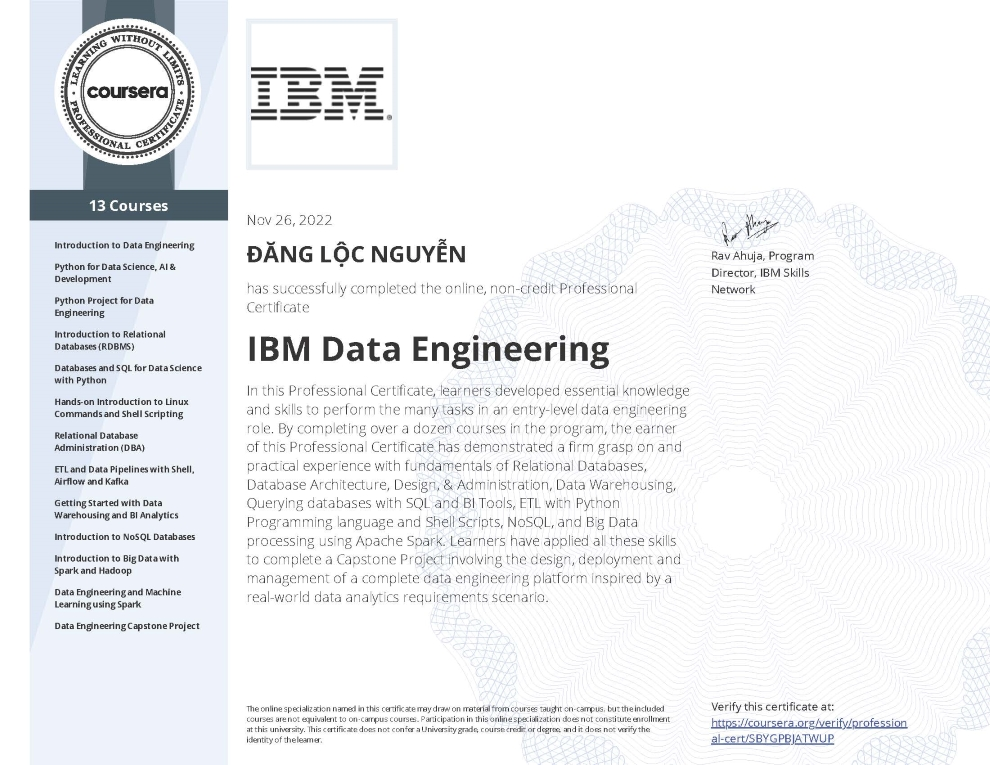

<h1 align="center">IBM Data Engineering Professional Certificate</h1>

## About The Course

This Professional Certificate is for anyone who wants to develop job-ready skills, tools, and a portfolio for an entry-level data engineer position. Throughout the self-paced online courses, you will immerse yourself in the role of a data engineer and acquire the essential skills you need to work with a range of tools and databases to design, deploy, and manage structured and unstructured data.  

By the end of this Professional Certificate, you will be able to explain and perform the key tasks required in a data engineering role. You will use the Python programming language and Linux/UNIX shell scripts to extract, transform and load (ETL) data. You will work with Relational Databases (RDBMS) and query data using SQL statements. You will use NoSQL databases and unstructured data.  You will be introduced to Big Data and work with Big Data engines like Hadoop and Spark.  You will gain experience with creating Data Warehouses and utilize Business Intelligence tools to analyze and extract insights.   

More details about the professional certificate here: <a href=https://www.coursera.org/professional-certificates/ibm-data-engineer><strong>IBM Data Engineering Professional Certificate</strong></a>

## Specialization Syllabus

This Professional Certificate contains 13 courses, as follows:

| No. | Course                                                               |Status| Certifications |
|:------:|----------------------------------------------------------------------------|:--:|:-------:|
| 01     | [Introduction to Data Engineering](./Course%201%20-%20Introduction%20to%20Data%20Engineering/)|✅|[link](https://www.coursera.org/account/accomplishments/certificate/BQUJ2HP4WGCS)|
| 02     | [Python for Data Science, AI & Development](./Course%202%20-%20Python%20for%20Data%20Science%2C%20AI%20%26%20Development/)|✅|[link](https://www.coursera.org/account/accomplishments/certificate/2MW4HKJY6DYV)|
| 03     | [Python Project for Data Engineering](./Course%203%20-%20Python%20Project%20for%20Data%20Engineering/)|✅|[link](https://www.coursera.org/account/accomplishments/certificate/LVHSSWZXGZNS)|
| 04     | [Introduction to Relational Databases (RDBMS)](./Course%204%20-%20Introduction%20to%20Relational%20Databases%20(RDBMS)/)|✅|[link](https://www.coursera.org/account/accomplishments/certificate/ZZWJHDB5W6XV)|
| 05     | [Databases and SQL for Data Science with Python](./Course%205%20-%20Databases%20and%20SQL%20for%20Data%20Science%20with%20Python/)|✅|[link](https://www.coursera.org/account/accomplishments/certificate/UX5L3ZKGKZQD)|
| 06     | [Hands-on Introduction to Linux Commands and Shell Scripting](./Course%206%20-%20Hands-on%20Introduction%20to%20Linux%20Commands%20and%20Shell%20Scripting/)|✅|[link](https://www.coursera.org/account/accomplishments/certificate/V2KWN9M42NT7)|
| 07     | [Relational Database Administration (DBA)](./Course%207%20-%20Relational%20Database%20Administration%20(DBA)/)|✅|[link](https://www.coursera.org/account/accomplishments/certificate/S2U8QYDN9XC5)|
| 08     | [ETL and Data Pipelines with Shell, Airflow and Kafka](./Course%208%20-%20ETL%20and%20Data%20Pipelines%20with%20Shell%2C%20Airflow%20and%20Kafka/)|✅|[link](https://www.coursera.org/account/accomplishments/certificate/76DQCG8A3UPX)|
| 09     | [Getting Started with Data Warehousing and BI Analytics](./Course%209%20-%20Getting%20Started%20with%20Data%20Warehousing%20and%20BI%20Analytics/)|✅|[link](https://www.coursera.org/account/accomplishments/certificate/8ZHK2Y7LJJSG)|
| 10     | [Introduction to NoSQL Databases](./Course%2010%20-%20Introduction%20to%20NoSQL%20Databases/)|✅|[link](https://www.coursera.org/account/accomplishments/certificate/AEB9ZE6AMQYP)|
| 11     | [Introduction to Big Data with Spark and Hadoop](./Course%2011%20-%20Introduction%20to%20Big%20Data%20with%20Spark%20and%20Hadoop/)|✅|[link](https://www.coursera.org/account/accomplishments/certificate/2C4FGYQAKWR2)|
| 12     | [Data Engineering and Machine Learning using Spark](./Course%2012%20-%20Data%20Engineering%20and%20Machine%20Learning%20using%20Spark/)|✅|[link](https://www.coursera.org/account/accomplishments/certificate/ZFJDJFFQS3TA)|
| 13     | [Data Engineering Capstone Project](./Course%2013%20-%20Data%20Engineering%20Capstone%20Project/)|✅|[link](https://www.coursera.org/account/accomplishments/certificate/FAXTQVKZUME9)|

## Certification

## Contact

Loc Nguyen Dang - lc.nguyedang123@gmail.com
Linkedin: [locnd172](https://www.linkedin.com/in/locnd172/)
Facebook: [Lộc](https://www.facebook.com/)